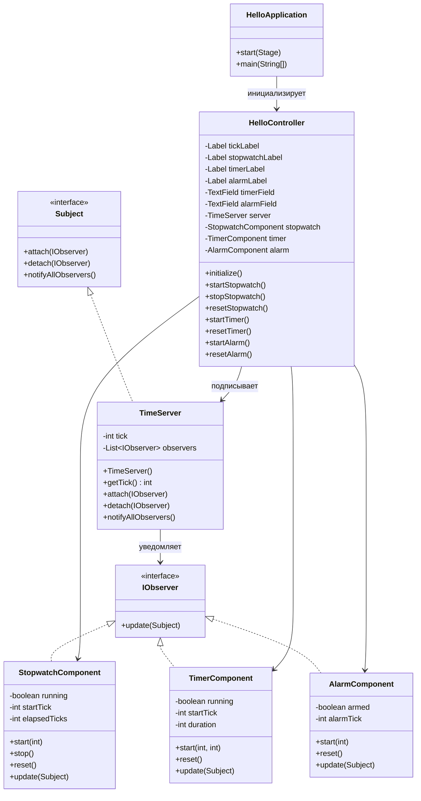

# TimeServer
----------------

## Описание  
TimeServer — это JavaFX-приложение, в котором единый сервер времени раз в секунду увеличивает глобальный тик и оповещает подключенные компоненты через паттерн Observer. Интерфейс позволяет запускать секундомер, настраивать обратный отсчёт таймера и ставить будильник на конкретный тик, визуально отслеживая состояние каждой функции. Проект демонстрирует реализацию событийной модели через JavaFX и потокобезопасное обновление UI.

---

## Технологический стек  
- Java 21  
- JavaFX 21 (Controls, FXML)  
- Maven (для сборки и запуска)  
- JavaFX Maven Plugin для подготовки standalone desktop-приложения  

---

## Ссылка на репозиторий и демо  
[GitHub репозиторий](https://github.com/kirillpustovojt/TimeServer)

---

## Основные возможности  
- Генерация глобального тика раз в секунду и отображение его значения  
- Секундомер с функциями старта, остановки и сброса, привязанный к системному тику  
- Таймер обратного отсчёта на указанное число тиков с текстовыми подсказками «ГОТОВО»  
- Будильник на конкретный тик с проверкой невозможных значений и визуальной индикацией срабатывания  
- Независимое управление всеми компонентами поверх одного источника времени  
- Обновление интерфейса из фонового потока через Platform.runLater, исключая гонки данных  

---

## Архитектура  
- Пакет `com.example.timeserver`:  
  - TimeServer реализует Subject, создаёт фоновый Timer и уведомляет наблюдателей каждую секунду  
  - Subject`/`IObserver задают контракт паттерна Observer для подключаемых компонентов  
  - StopwatchComponent, TimerComponent, AlarmComponent реализуют IObserver и содержат бизнес-логику секундомера, таймера и будильника  
- Контроллер `HelloController`:  
  - Создаёт компоненты, подписывает их на сервер времени, обрабатывает ввод пользователя и валидацию значений  
  - Управляет элементами Label`/`TextField, обрабатывает события кнопок и выводит ошибки  
- `HelloApplication`:  
  - Точка входа, загружает hello-view.fxml, подготавливает сцену JavaFX и запускает приложение  
- FXML (`hello-view.fxml`):  
  - Описывает вертикальный интерфейс с блоками для тиков, секундомера, таймера и будильника, включая кнопки управления и поля ввода  

---

## Диаграмма классов


---

## Установка и запуск

1. Клонировать репозиторий:  
```bash
git clone https://github.com/mdobrynina/Time.git
```
2. Перейти в директорию проекта:
   cd TimeServer
3. Собрать приложение:
   mvn clean install
4. Запустить JavaFX-приложение:
   mvn javafx:run
---

## Использование

1. После старта приложения сервер начинает увеличивать глобальный тик и отображать его в верхней части окна.  
2. В блоке «Секундомер» нажмите «Старт», чтобы начать отсчёт, используйте «Стоп» и «Сброс» для управления.  
3. В блоке «Таймер» введите количество тиков (секунд), нажмите «Старт» и следите за обратным отсчётом; «Сброс» отменяет таймер.  
4. В блоке «Будильник» укажите номер будущего тика и нажмите «Старт» — при достижении значения появится значок 🔔.  
5. Ошибки валидации (например, установка будильника на прошедший тик) отображаются прямо под блоком будильника.  

---

## Особенности реализации

- Observer-паттерн: сервер времени и компоненты не зависят друг от друга и взаимодействуют через интерфейсы Subject и IObserver.  
- Потокобезопасное UI: фоновые обновления из TimerTask пересылаются в JavaFX Application Thread через Platform.runLater.  
- Единый источник истины: таймер, будильник и секундомер используют одно значение тика, поэтому показатели всегда синхронизированы.  
- Простая валидация: контроллер проверяет невозможные значения (например, прошедшие тики для будильника) и сообщает об ошибках пользователю.  

---

## Зависимости

- Java 21  
- JavaFX 21 (`javafx-controls`, `javafx-fxml`)  
- Maven 3.x + JavaFX Maven Plugin 0.0.8  
- JUnit 5 (для потенциальных модульных тестов)  

---

## Ограничения и известные проблемы

- Ввод в текстовые поля пока не защищён от нечисловых значений — требуется дополнительная валидация.  
- Будильник и таймер сбрасываются при перезапуске приложения, так как тик не сохраняется между сессиями.  
- Проект не содержит автоматизированных тестов; корректность проверяется вручную через UI.  

---

## Контакты и поддержка

Для вопросов и предложений открывайте Issue в репозитории или создавайте Pull Request.

---

## Скриншоты

Скриншоты интерфейса будут добавлены после подготовки окончательных макетов.
